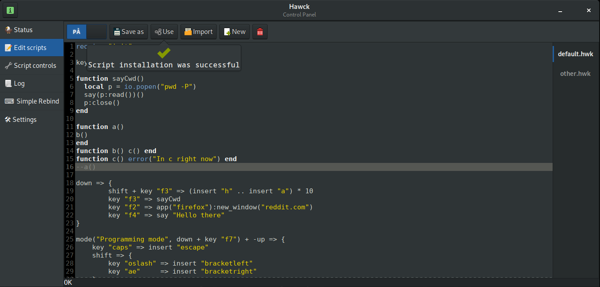
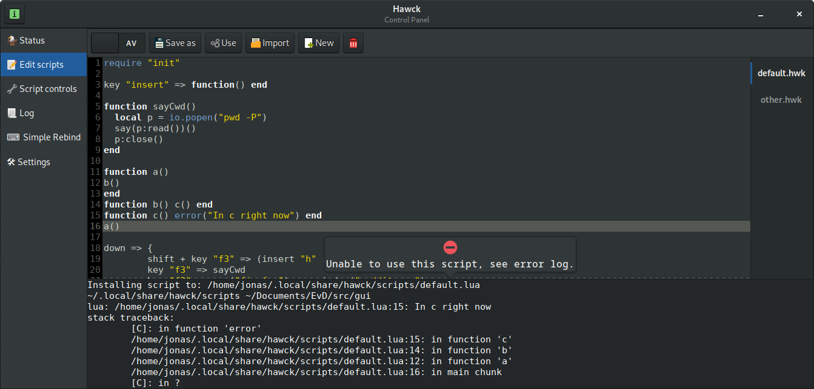

## A key-rebinding daemon

Linux with all it's combinations of window managers, display servers and
desktop environments needs a key-rebinding system that works everywhere.

Hawck intercepts key presses and lets you write Lua scripts to perform
actions or modify keys depending on your needs.

Your Lua scripts will work on Wayland, X11, and every WM/DE you throw at
them, as well as console ttys.

The ultimate goal of the project is to serve as a user-friendly Linux
alternative to AutoHotkey, but this time with a sane scripting language.

Common concrete use cases:
- Rebind caps lock to ctrl or escape:
```lua
key "caps" => replace "escape"
-- , or
key "caps" => replace "control"
```
- Conditionally replace caps lock (or any other replacement)
```lua
-- Pressing F7 will activate the replacement, and pressing F7
-- again will disable it.
mode("Caps => Ctrl mode", down + key "f7") + -up => {
    key "caps" => replace "control"
}
```
- Paste into a tty, or another program which does not support pasting
```lua
function getClipboard()
    -- get-clipboard should be replaced with whatever works with your setup.
    local p = io.popen("get-clipboard")
    local clip = p:read("*a")
    p:close()
    return clip
end

shift + alt + key "v" => function ()
  local clip_contents = getClipboard()
  write(clip_contents)() -- Note the extra parens, write() returns a closure
end
```
- Make non-us keyboards more convenient for programming:
```lua
-- Replace with your respective european characters
shift + key "ø" => insert "["
key "ø" => insert "{"
-- , or
shift + key "æ" => insert "]"
key "æ" => insert "}"
```
- Store a common phrase and activate it with a key-binding
```lua
local seals_pasta = "What the **** did you just say about me you little *****? I'll have you know I graduated top of my class from…"
shift + alt + key "p" => write(seals_pasta)
```
- Run .desktop application actions, and generally launch programs
```lua
shift + alt + key "f" => app("firefox"):new_window("https://youtube.com")
shift + alt + key "w" => app("firefox"):new_private_window("( ͡° ͜ʖ ͡°)")
```

<small>
The name is a portmanteau of "Hack" and "AWK", as the program started out as a
bit of a hack, and the scripts take inspiration from the pattern-matching style
of the AWK programming language (plus, hawks are pretty cool I guess.)
</small>

## For package maintainers

See the `install.sh` script for how Hawck should be installed, it contains
a few notes for package maintainers.

To anyone considering or having created a package for Hawck, please consider
typing out an issue for it (with instructions for your distribution) so that
it may be added to this README.

## How do I install it?

Download or clone the GIT repo, and run the `install.sh` program from the
command line. This script has been tested for Ubuntu 18.04.

You will need to reboot the computer after running the installer, because it
needs to add your user to a new group (with Ubuntu it seems like logging out and
back in isn't enough.)

When you've started the computer back up again, run the following commands:

    $ sudo systemctl start hawck-inputd
    $ hawck-macrod
    $ hawck-ui

>PS: There is a known bug that sometimes causes `hawck-ui` to hang on startup, in
>that case, try again.

>Important note for people using sway, i3, openbox and similar minimal WMs: You
>need to have a [Polkit Authentication Agent](https://wiki.archlinux.org/index.php/Polkit#Authentication_agents)
>running to use the UI.

Move over to the settings tab, and change your keymap (this will hopefully be
done automatically soon.)

You can now move on to the "Edit scripts" tab and attempt to edit/enable the
default test script.

If you want to keep using Hawck, and want to have it start up automatically,
move over to Settings and click the autostart toggle button, you will be
prompted for your password.

## Security

As you can imagine, with all this power comes great responsibility. Here's
an explanation of the strategy used to make things a bit more secure.

When Hawck starts up it splits up into two daemons that communicate with
each other:

- InputD
  - Runs under the 'hawck-input' user and is part of the input group,
    letting it read from /dev/input/ devices.
  - Member of the hawck-uinput group, allowing it to use /dev/uinput
  - Grabs keyboard input exclusively.
  - Knows which keys to pass over to the macro daemon
  - Controls a virtual keyboard that is used to emulate
    keypresses, this includes re-pressing keys that did
    not need to be handled by the macro daemon.
- MacroD
  - Runs under the desktop user.
  - Listens for keypresses sent from the keyboard daemon.
  - Passes received keypresses into Lua scripts in order to
    perform actions or conditionally modify the keys.
  - Potential output keys produced by the script are sent
    back to the keyboard daemon.
    - Inconsequential implementation details: Having two virtual
      keyboards operated by both daemons opens up an entirely new
      can of worms especially for modifier keys.
      

  
The keyboard daemon contains a whitelist of keys that the macro daemon
is allowed to see, this whitelist is derived from the Lua scripts used.
This means that the process run under the desktop user never sees all
keyboard input, this is important as the `/proc/` filesystem would
allow any process launched by the user to see all keyboard input if
it were not filtered.

If you are using X11 your key-presses can already be intercepted without any
special permission, so all this extra security is unnecessary.

Read the alternative strategies FAQ section below for more information and a
more thorough explanation of the drawbacks with the current model.

### Scripting

Hawck is scripted with, you guessed it, hawk scripts. These scripts are
essentially just Lua with some extra operators. The hwk2lua program is
used to transpile `.hwk` files into `.lua` files (this happens automagically
if you use Hawck-UI.)

As an example, here is a hawk script:

```lua
-- Programming mode is activated by pressing down the f7 key.
-- It is only run when a key is not being released (-up)
mode("Programming mode", down + key "f7") + -up => {
    -- When caps-lock is pressed, substitute with escape
    key "caps" => replace "escape"
    shift => {
        key "ø" => insert "["
        key "æ" => insert "]"
    }
    key "ø" => insert "{"
    key "æ" => insert "}"
    -- Write "Hello " 10 times using the virtual keyboard,
    -- then show a "World!" notification
    key "F12" => (write "Hello ") * 10 .. say "World!"
}
```

With this script the `ø` character produces `{`, similarly
for the other bindings. But only if `"Programming mode"` is enabled.

This transpiles to the following (without comments):

```lua
__match[mode("Programming mode", down + key "f7") + -up ] = MatchScope.new(function (__match)
    __match[key "caps"] = insert "escape"
    __match[shift] = MatchScope.new(function (__match)
        __match[key "oslash"] = insert "bracketleft"
        __match[key "ae"    ] = insert "bracketright"
    end)
    __match[key "oslash"] = insert "braceleft"
    __match[key "ae"    ] = insert "braceright"
    __match[key "F12"   ] = (write "Hello ") * 10 .. say "World!"
end)
```

Which is what the `hawck-macrod` daemon actually runs. Note
that the only differences between plain Lua syntax and the
added Hawck-specific syntax is the `=>` operator and how it
modifies the behaviour of `{}` braces. Currently the "transpiler"
only consists of ~100 lines of Python code, the remaining
syntactic sugar is achieved using Lua operator overloading
(see `match.lua` for details.)

<small>
Writing DSLs can be fun, but can also be too much fun, resulting
in an overengineered language requiring a lot of maintenance.

This is why Lua, with a single extra operator that was
easy to implement is what I went with in Hawck.
</small>

### Supported platforms

- Linux
  - Currently the only supported platform, as input-grabbing in this
    way is very platform specific.
    
If `UDevice.cpp` and `Keyboard.cpp` were to be ported everything
else should run just fine under Mac OS X or BSD.

### Dependencies:

- Lua 5.3
- Python 3.6
- nlohmann::json
- Catch2
- C++17 compiler
  - Compiles under both `gcc 8.1.0` and `clang 6.0.1`

## GUI

#### Edit scripts



In the edit scripts section you can perform quick edits
on your scripts, and enable/disable them.

After editing the script just click on "Use" to send
the script to the daemon. The interface will then let
you know whether or not the installation went smoothly.



## View logs

<!--  -->

On the log page you can view errors that have been emitted from
your scripts.

## FAQ

#### Is my keyboard layout supported?

If you're using a Norwegian or US keyboard, yes.
If not, maybe.

If not you might have to do some tweaking, feel free to report
an issue on GitHub for your keymap.

#### Hotplugging keyboards

When `hawck-inputd` starts up it finds the connected keyboards
then proceeds to lock them and listen for key events.

You can then plug the keyboards out and in as many times as
you please.

But, emphasis on out and in, not in and out. `Inputd` will
only use the keyboards that were available when it started.
Changing this to support adding more keyboards while inputd
is running is planned, it is mostly a relic of having to
debug `inputd` by plugging in another keyboard (which I
didn't want it locking on to.)

Currently, if you plug in another keyboard you can just
run `systemctl restart hawck-inputd` and it should find
the new keyboard, and automatically lock it the next time
it is plugged in (before you restart hawck-inputd again.)

#### Alternative security strategies and motivations

The current model is a compromise between ease of use, and security.

The issue with the current Hawck security model is that binding all keys
on your keyboard (or even 20-30% of them, depending on which keys they
are and how common they are in your language) effectively renders the
security model useless.

Here are some alternative models that have been considered:

- Run all scripts inside inputd
  - In this model there is only a single daemon, hawck-inputd
  - This is planned as an optional alternative, and a lot of
    the code has already been written, but it takes a lot of
    work and consideration to make this work well, and securely.
    - Work on this might just be scrapped for script-less
      rebinding directly inside inputd.
  - Scripts are sandboxed and are not allowed to communicate
    with the outside world, this includes launching programs.
    - Problem #1: Not being able to bind keys to launchers was
      a deal breaker for me.
    - Problem #2: Perfect sandboxing isn't easy to pull of, it
      requires very careful programming and as such takes longer to
      implement.
- Don't use scripts
  - This is obviously not as flexible.
  - A common use case for something like this is very simple
    rebindings, like caps => control. This system would work
    very well for those cases.
  - Although this is planned as an alternative, it can never
    be the only supported mode, as Hawck aims to be as useful
    when it comes to keyboard automation as something like
    AutoHotkey.
- "Abandon all hope, ye who enter unsafe mode"
  - For a lot of users, especially the ones still on X11, these
    issues are not a concern. They might want a model that just
    let's them do whatever they want whenever they want without
    any bothersome password prompts. This is not recommended,
    but a perfectly valid stance.
  - This is already supported, opt-in, by toggling unsafe mode
    in the settings panel of hawck-ui.

- What I'm currently aiming for is being able to support these
  three modes:
  - Sandboxed inside inputd
    - Used for most simple key-replacement scripts.
  - Whitelisted keys passed from inputd to macrod (current method)
    - Used for anything that can't be done from the sandbox.
  - Unsafe mode (optional current method)
    - Used by X11 users, and users who just don't care.

Ideally the hawck-ui editor should be able to start off
assuming sandboxed mode, then inform the user about the
need to switch to whitelist mode if it sees use of any feature 
unsupported in the sandbox, like `io.popen` or `app`.

#### Synchronous and asynchronous keyboard locking explained

If you read the logs you might see something like this:
```
hawck-inputd[7672]: Running Hawck InputD ...
hawck-inputd[7672]: Attempting to get lock on device: Logitech Logitech G710 Keyboard @ usb-0000:00:14.0-4/input0
hawck-inputd[7672]: Locking keyboard: Logitech Logitech G710 Keyboard ...
hawck-inputd[7672]: Preparing async lock on: Logitech Logitech G710 Keyboard @ usb-0000:00:14.0-4/input0
hawck-inputd[7672]: Attempting to get lock on device: AT Translated Set 2 keyboard @ isa0060/serio0/input0
hawck-inputd[7672]: Locking keyboard: AT Translated Set 2 keyboard ...
hawck-inputd[7672]: Immediate lock on: AT Translated Set 2 keyboard @ isa0060/serio0/input0
hawck-inputd[7672]: Acquired lock on keyboard: Logitech Logitech G710 Keyboard
```
`hawck-inputd` employs two different methods for locking keyboards.

One is the simple immediate lock, where an `ioctl` call is used to
gain exclusive access to the keyboard immediately.

The other one is an asynchronous lock, which solves the following
problem, illustrated by using an immediate lock where it should
not be used:

- hawck-inputd is not running
- user holds down shift on G710 keyboard
- GNOME desktop receives a [down + shift] event, from G710 keyboard
- hawck-inputd starts up
- hawck-inputd acquires an immediate lock on G710
  - GNOME will now not see any more of the G710 keypresses
- hawck-inputd registers a virtual keyboard device
  - This device will now echo key events that come from G710,
    and any other keyboard on the system.
- user stops pressing the shift key on G710 keyboard
- hawck-inputd receives the [up + shift] event
- hawck-inputd will now echo the [up + shift] event through
  its virtual keyboard.
- GNOME desktop sees an [up + shift] event, from Hawck keyboard
  - GNOME doesn't (and shouldn't) do anything with this event
- GNOME desktop still considers the shift key to be held down,
  because as far as it knows it is still held down on one of the
  keyboards, Hawck stole the memo.
- user presses w, but what comes out is "W"
- No amount of pressing and releasing shift solves the problem.
- user is having a bad time

Asynchronous lock solves this problem by simply waiting until
every key has been released before the keyboard is locked.

#### The hwk2lua script is terrible and you should be ashamed.

Yes, it's a quick-and-dirty script and has a few edge cases.
For example this string syntax is not supported `[==[strings]==]`
if it contains any `=>` operators.

I think it works well enough for what it is used for, but I have
definitely considered replacing it with a more robust Haskell/Parsec
parser, but only if I find myself running into too many issues with
the current hack.

## Known Bugs:

- Outputting keys too quickly:
  - GNOME Wayland has a bug where it will drop a lot of keys
  - Workaround: run hawck-inputd with the --udev-event-delay flag set to 3800 (µs)
- hawck-ui will sometimes fail to start
  - It ends up waiting on a FIFO forever.
  - Workaround: Kill it and run it again
