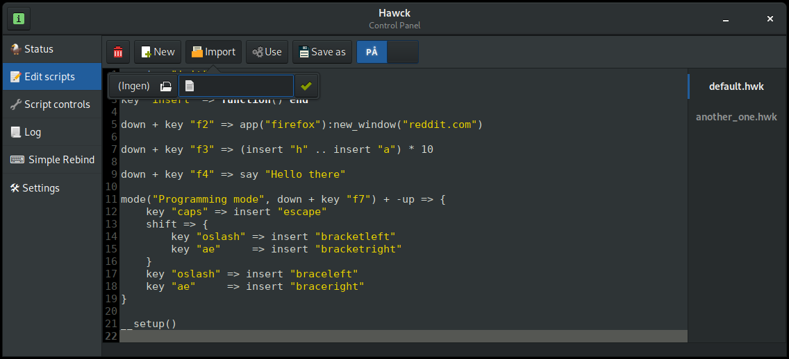
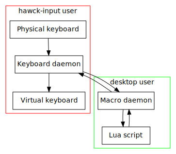

## A key-rebinding daemon

Hawck runs in user space and uses kernel-apis to intercept key presses. It can
run key-presses through Lua scripts in order to modify the behaviour of keys.

This can mean simple rebindings, launching of programs, or really anything else.

Your rebindings will work in X11, Wayland, and even in the text-only TTYs.
This is possible because Hawck processes inputs before any of these systems
see them.

The name is a portmanteau of "Hack" and "AWK", as the program started out as a
bit of a hack, and the scripts take inspiration from the pattern-matching style
of the AWK programming language (plus, hawks are pretty cool I guess.)

### Motivation

There is currently no simple way to rebind keys in Linux without resorting
to solutions that are either specific to a display server (X11 or Wayland)
or to a desktop environment / window manager. These solutions also tend
not to be very user friendly.

So the motivation for Hawck is to have a simple method for creating
rebindings or more advanced keyboard macros, and have these macros work
everywhere.

### NOTICE: This software is in alpha³ stage

I personally use the software daily without any issues, but I do not recommend
anyone to actually auto-start this software on boot, there may be a few bugs,
and in the case of auto-starting the daemon with SystemD on boot these problems
may render the computer unusable until a system recovery is performed or another
keyboard is plugged in (hawck only listens to a single keyboard at a time.)

Furthermore the software really isn't user friendly yet, and is not easy to set
up, I recommend users needing a key-rebinding daemon who are not experienced in
C++ and Lua to look somewhere else for now.

### Scope

Currently the single aim for this project is keyboard automation, involving
other methods of input like mice and joysticks is not planned.

### Scripting

Hawck is scripted with, you guessed it, hawk scripts. These scripts are
essentially just Lua with some extra operators. The hwk2lua program is
used to transpile `.hwk` files into `.lua` files.

As an example, here is a hawk script:

```lua
-- Programming mode is activated by pressing down the f7 key.
-- It is only run when a key is not being released (-up)
mode("Programming mode", down + key "f7") + -up => {
    -- When caps-lock is pressed, substitute with escape
    key "caps" => insert "escape"
    shift => {
        -- When shift is held, turn æ/ø into ]/[
        key "oslash" => insert "bracketleft"
        key "ae"     => insert "bracketright"
    }
    -- Turn æ/ø into }/{
    key "oslash" => insert "braceleft"
    key "ae"     => insert "braceright"
}
```

This transpiles to the following (without comments):

```lua
match[mode("Programming mode", down + key "f7") + -up ] = MatchScope.new(function (match)
    match[key "caps" ] = insert "escape"
    match[shift ] = MatchScope.new(function (match)
        match[key "oslash" ] = insert "bracketleft"
        match[key "ae"     ] = insert "bracketright"
    end)
    match[key "oslash" ] = insert "braceleft"
    match[key "ae"     ] = insert "braceright"
end)
```

Which is what hawck actually runs, if you are experience with Lua
you might want to have a look into `match.lua` to see how
everything works.

Note: Comments are usually not removed, this is to preserve
line numbers to make debugging easier.


### Supported platforms

- Linux
  - Currently the only supported platform, as input-grabbing in this
    way is very platform specific.
    
If `UDevice.cpp` and `Keyboard.cpp` were to be ported everything
else should run just fine under Mac OS X or BSD.

### Dependencies:

- Lua 5.3
- Python 3.6
- nlohmann::json
- Catch2
- C++17 compiler
  - Compiles under both `gcc 8.1.0` and `clang 6.0.1`

## GUI

Currently the gui is in an unfinished state, but is still
being worked on.

### Features

#### Edit scripts



In the edit scripts section you can perform quick edits
on your scripts, and enable/disable them.

After editing the script just click on "Use" to send
the script to the daemon.

### Planned features
- Simplified key rebinding (no need to write a script)
- Log browser
- Simplified script controls for imported scripts.

## Security

When Hawck starts up it splits up into two daemons that communicate with
each other:

- Keyboard daemon
  - Runs under the 'hawck-grab' user and is part of the input group,
    letting it read from /dev/input/ devices.
  - Grabs keyboard input exclusively.
  - Knows which keys to pass over to the macro daemon
  - Controls a virtual keyboard that is used to emulate
    keypresses, this includes re-pressing keys that did
    not need to be handled by the macro daemon.
- Macro daemon
  - Runs under the desktop user.
  - Listens for keypresses sent from the keyboard daemon.
  - Passes received keypresses into Lua scripts in order to
    perform actions or conditionally modify the keys.
  - Potential output keys produced by the script are sent
    back to the keyboard daemon.
    - Inconsequential implementation details: Having two virtual
      keyboards operated by both daemon opens up an entirely new
      can of worms especially for modifier keys.
      

  
The keyboard daemon contains a whitelist of keys that the macro daemon
is allowed to see, this whitelist is derived from the Lua scripts used.
This means that the process run under the desktop user never sees all
keyboard input, this is important as the `/proc/` filesystem would
allow any process launched by the user to see all keyboard input if
it were not filtered.

If you are using X11 your key-presses can already be intercepted without any
special permission, so all this extra security is unnecessary, but this program
is primarily aimed towards Wayland users.

## Known Bugs:

- Outputting keys too quickly:
  - In macros that result in a lot of keys being outputted in
    a short amount of time some keys may be skipped, leading
    to inconsistencies in output.
  - Workaround: Wait for a few milliseconds between emulated keypresses,
    this seems to only be noticeable with macros that produce
    a **lot of output**.

